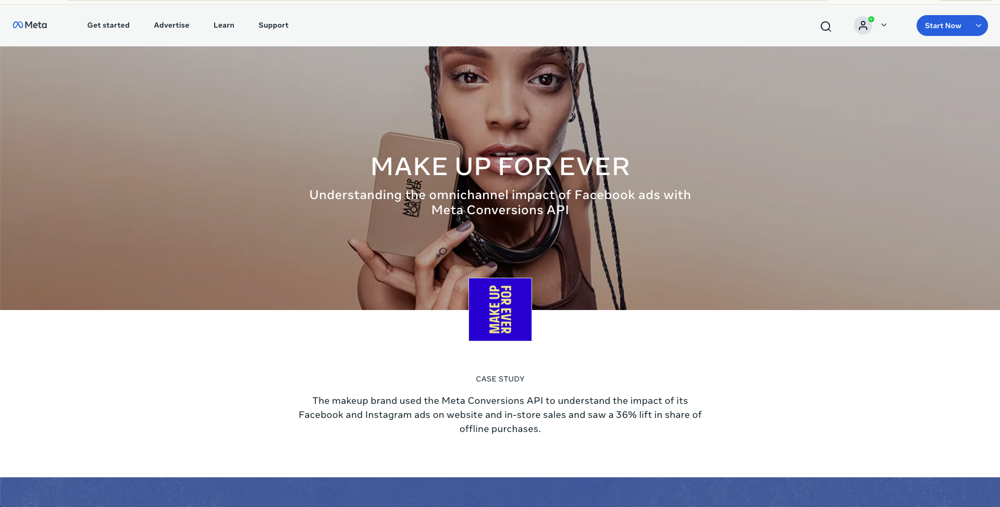
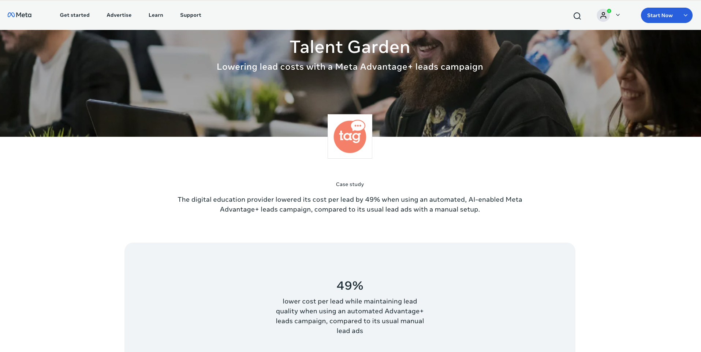
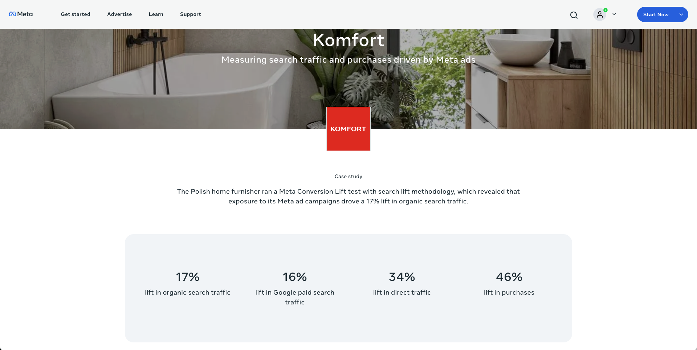
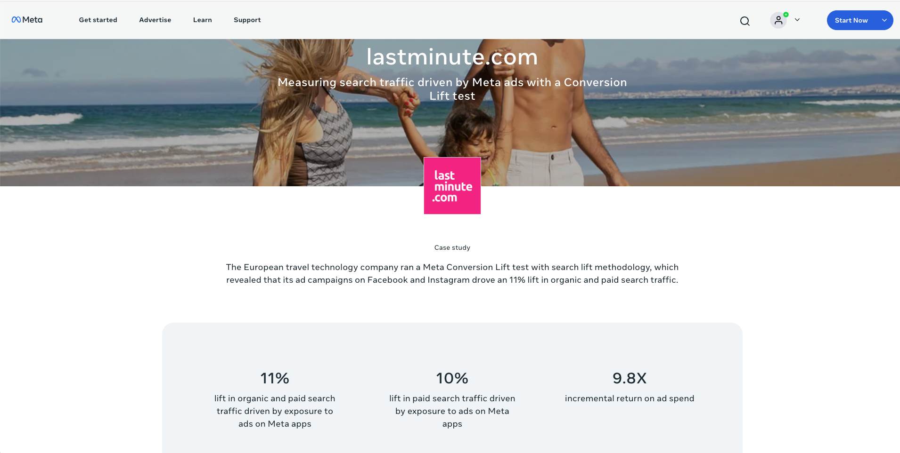
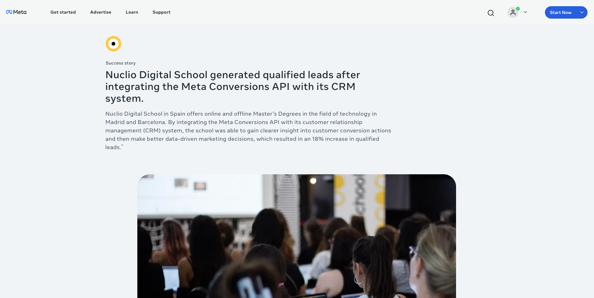
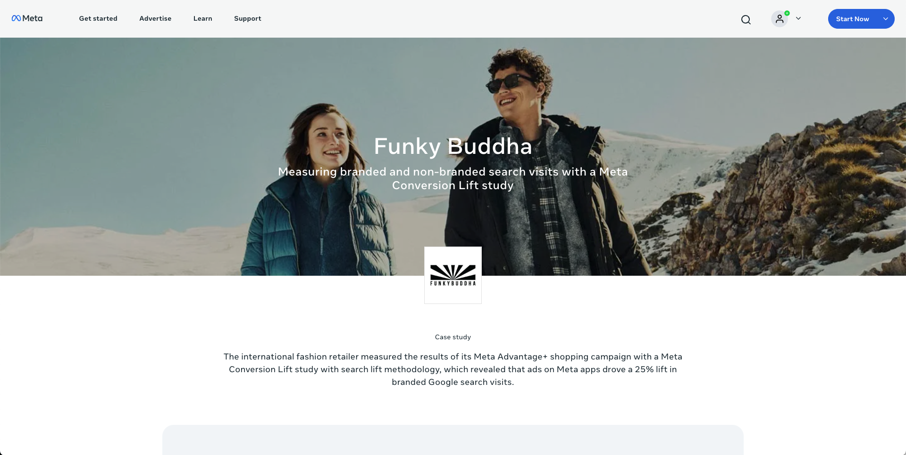
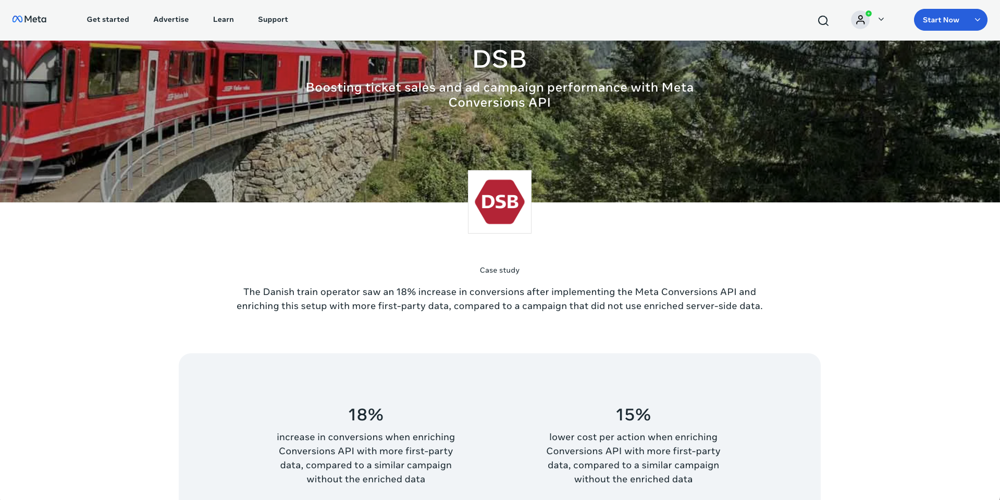
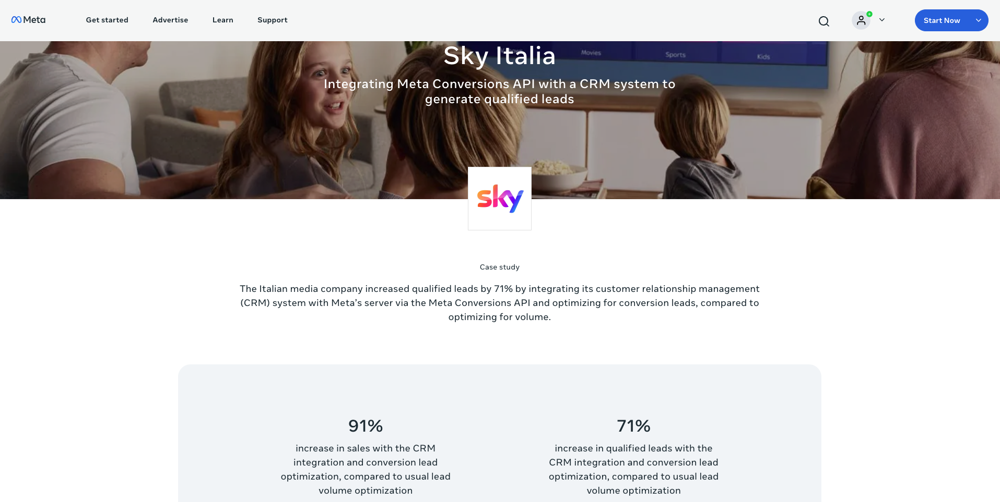
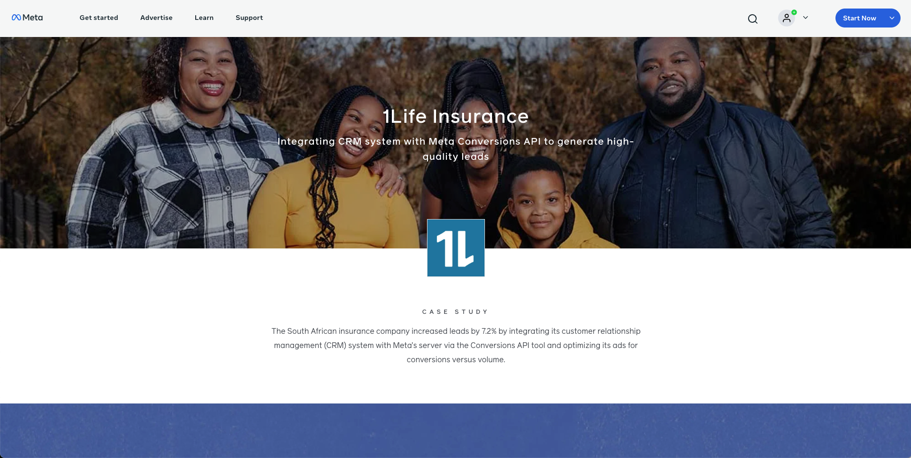
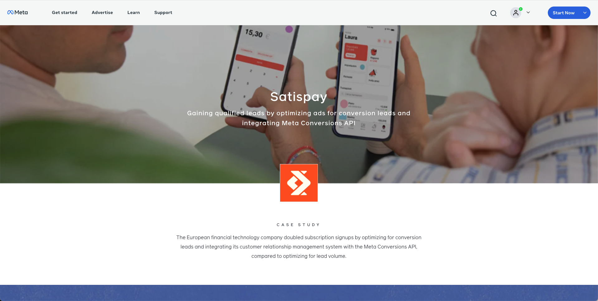

# Meta Conversions API – Impact Showcase

## Overview
This repository demonstrates how Meta’s **Conversions API (CAPI)** helps advertisers strengthen their marketing effectiveness through privacy-safe, server-side data connections.  
By sending conversion events directly from the business’s server to Meta, companies are able to improve signal quality, campaign optimization, and measurable return on investment — even in a changing privacy landscape.  

Each case study below illustrates real-world results achieved through improved data accuracy, stronger event matching, and enhanced campaign performance after implementing Meta’s Conversions API.  

---

## Success Stories

### [Make up for ever](https://www.facebook.com/business/success/3-make-up-for-ever)
The makeup brand used the Meta Conversions API to understand the impact of its Facebook and Instagram ads on website and in-store sales and saw a 36% lift in share of offline purchases.

### [Talent Garden](https://www.facebook.com/business/success/talent-garden)
The digital education provider lowered its cost per lead by 49% when using an automated, AI-enabled Meta Advantage+ leads campaign, compared to its usual lead ads with a manual setup.

### [Komfort](https://www.facebook.com/business/success/2-komfort)
The home furnisher ran a Meta Conversion Lift test with search lift methodology, which revealed that exposure to its Meta ad campaigns drove a 17% lift in organic search traffic.

### [lastminute.com](https://www.facebook.com/business/success/lastminute-com)
The travel technology company ran a Meta Conversion Lift test with search lift methodology, which revealed that its ad campaigns on Facebook and Instagram drove an 11% lift in organic and paid search traffic.

### [Nuclio Digital School](https://www.facebook.com/business/success/nuclio-digital-school)
Nuclio Digital School in Spain offers online and offline Master’s Degrees in the field of technology in Madrid and Barcelona. By integrating the Meta Conversions API with its customer relationship management (CRM) system, the school was able to gain clearer insight into customer conversion actions and then make better data-driven marketing decisions, which resulted in an 18% increase in qualified leads.*

### [Funky Buddha](https://www.facebook.com/business/success/funky-buddha)
The international fashion retailer measured the results of its Meta Advantage+ shopping campaign with a Meta Conversion Lift study with search lift methodology, which revealed that ads on Meta apps drove a 25% lift in branded Google search visits.

### [DSB](https://www.facebook.com/business/success/dsb)
The Danish train operator saw an 18% increase in conversions after implementing the Meta Conversions API and enriching this setup with more first-party data, compared to a campaign that did not use enriched server-side data.

### [Sky Italia](https://www.facebook.com/business/success/sky-italia)
The Italian media company increased qualified leads by 71% by integrating its customer relationship management (CRM) system with Meta’s server via the Meta Conversions API and optimizing for conversion leads, compared to optimizing for volume.

### [1Life Insurance](https://www.facebook.com/business/success/1life-insurance)
The South African insurance company increased leads by 7.2% by integrating its customer relationship management (CRM) system with Meta’s server via the Conversions API tool and optimizing its ads for conversions versus volume.

### [Clikalia Mexico](https://www.facebook.com/business/success/clikalia-mexico)
Clikalia adopted CAPI to enhance measurement precision in property transactions, improving audience quality and overall marketing performance in the competitive real-estate sector.

### [Satispay](https://www.facebook.com/business/success/satispay)
The European financial technology company doubled subscription signups by optimizing for conversion leads and integrating its customer relationship management system with the Meta Conversions API, compared to optimizing for lead volume.

---

## Summary
Across diverse industries — retail, travel, education, media, insurance, and fintech — the **Meta Conversions API** has enabled businesses to:  
- Build **reliable, privacy-aware data pipelines** that power ad optimization.  
- Achieve **higher event match quality**, improving Meta Ads delivery efficiency.  
- Gain **more complete performance measurement**, driving stronger ROI.  

These stories, publicly available via [Meta Business Success](https://www.facebook.com/business/success), illustrate how high-fidelity server-to-Meta integrations continue to redefine modern digital marketing.  
